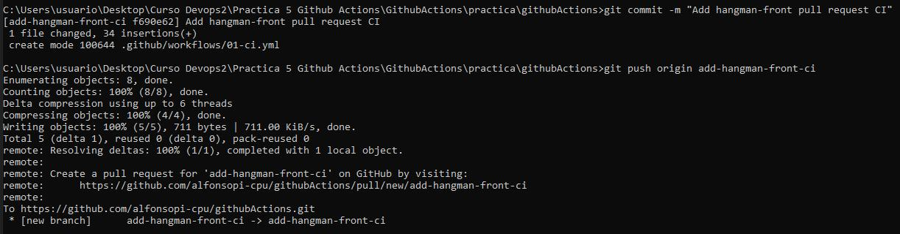
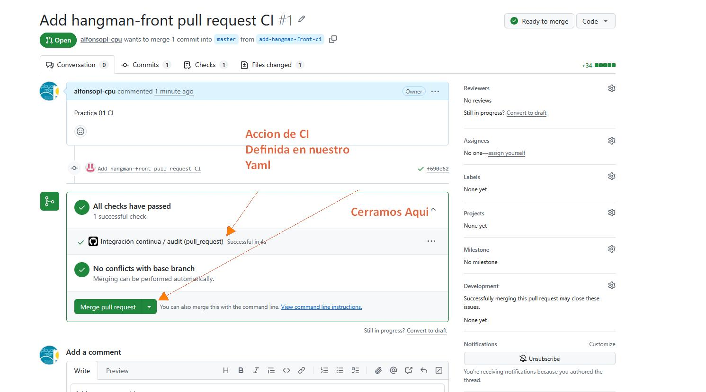
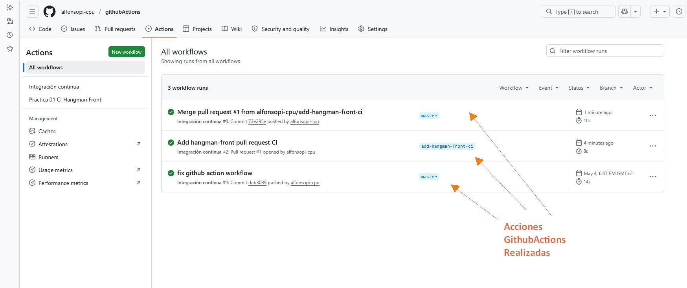

# Tareas de la practica Github Actions 

# 1. Que es un Github Actions ?

GitHub Actions es una herramienta de automatización integrada en GitHub que permite ejecutar tareas automáticamente cuando ocurren ciertos eventos en un repositorio, por ejemplo cuando alguien hace un push o abre una Pull Request. Estas tareas se definen mediante workflows escritos en YAML y sirven para automatizar procesos como compilar proyectos, ejecutar tests, desplegar aplicaciones o analizar código, formando parte de lo que se conoce como integración continua (CI/CD).
En resumen un YAML en ./github/workflows configura una automatizacion. 
 
     Evento (push / Pull Request) 
     --> 
     Accion ( compilar /  tests / desplegar / analizar código)

#  Practica 1 CI 

Debes crear un nuevo workflow que se dispare cuando haya cambios en el proyecto hangman-front y exista una nueva pull request (deben darse las dos condiciones a la vez). El workflow ejecutará las siguientes operaciones:

    Build del proyecto
    Ejecución de los test unitarios


## 2. Como lo hacemos? 
### 1º Creando el fichero YAML

En nuestro ejercicio uno es este 

```YAML

name: Practica 01 CI Hangman Front 

on:
  pull_request:
    paths:
      - 'hangman-front/**'

jobs:
  build-and-test:
    runs-on: ubuntu-latest

    defaults:
      run:
        working-directory: hangman-front

    steps:
      - name: Checkout
        uses: actions/checkout@v4

      - name: Setup Node
        uses: actions/setup-node@v4
        with:
          node-version: 18
          cache: npm
          cache-dependency-path: hangman-front/package-lock.json

      - name: Install dependencies
        run: npm ci

      - name: Build project
        run: npm run build

      - name: Run unit tests
        run: npm test

```


## 3. Como lo instalamos ? 

### 3.1  hacemos una rama nueva 

git checkout es un comando de Git que se utiliza para cambiar de rama dentro de un repositorio o para recuperar archivos concretos. Cuando haces algo como git checkout -b nueva-rama, estás creando una nueva rama y moviéndote a ella al mismo tiempo. Las ramas permiten trabajar en cambios o nuevas funcionalidades sin afectar al código principal del proyecto hasta que todo esté listo.

```bash 
git checkout -b add-hangman-front-ci
```

### 3.2 Añadimos el fichero  al repositorio y lo subimos 

```bash 
git add .github/workflows/hangman-front-pr.yml
git commit -m "Add hangman-front pull request CI"
git push origin add-hangman-front-ci
```




### 3.3 Hacemos el pull request 

Una Pull Request (PR) es una solicitud para incorporar cambios de una rama a otra dentro de un repositorio de GitHub. Se utiliza para revisar código antes de integrarlo en la rama principal del proyecto. Cuando abres una PR, otros desarrolladores pueden revisar tus cambios, comentar errores, sugerir mejoras y aprobar el código. Además, es común que se ejecuten automáticamente workflows de GitHub Actions para comprobar que el proyecto sigue funcionando correctamente antes de aceptar los cambios.




### 3.4 En workflows se ve toda la ejecucion realizada




#  Practica 2 C2

Crea un nuevo workflow que se dispare manualmente y haga lo siguiente:

    Crear una nueva imagen de Docker
    Publicar dicha imagen en el container registry de GitHub

    Nota: intenta usar las actions de Docker vistas en clase


## 2. Como lo hacemos? 
### 1º Creando el fichero YAML

En nuestro ejercicio uno es este 

```YAML

name: Docker Publish

on:
  workflow_dispatch:

permissions:
  contents: read
  packages: write

jobs:
  docker:
    runs-on: ubuntu-latest

    steps:
      - name: Checkout repository
        uses: actions/checkout@v4

      - name: Login to GitHub Container Registry
        uses: docker/login-action@v4
        with:
          registry: ghcr.io
          username: ${{ github.actor }}
          password: ${{ secrets.GITHUB_TOKEN }}

      - name: Extract Docker metadata
        uses: docker/metadata-action@v5
        with:
          images: ghcr.io/${{ github.repository }}

      - name: Build and push Docker image
        uses: docker/build-push-action@v6
        with:
          context: .
          push: true
          tags: ghcr.io/${{ github.repository }}:latest

```


## 3. Como lo instalamos ? 


### 3.1 Añadimos el fichero  al repositorio y lo subimos 


```bash 
git add .github/workflows/02-docker-publish.yml
git commit -m "git commit -m 2nd practica docker subir yml"
git push origin master
```

### 3.2 Ve a Actions en GitHub y Seleccionamos Docker Publish
Como este workflow es de ejecucion manual voy a ejecutarlo 


### 3.2 Al Pulsar Run workflow y confirmarlo nos sale ejecutandose

